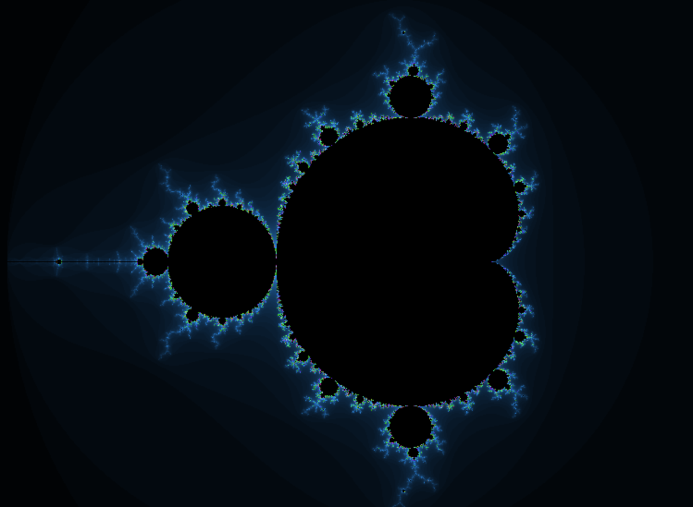

# fract-ol

`fract-ol` est un projet visant à générer des fractales interactives, incluant les célèbres ensembles de Mandelbrot et Julia. 
Il permet de zoomer, d'explorer ces fractales et de modifier leurs couleurs directement depuis la ligne de commande. 

## Fonctionnalités
- Génération des ensembles de Mandelbrot et Julia.
- Zoom centré pour explorer les fractales.
- Modification des couleurs à partir de la ligne de commande.
- Support des options personnalisées pour ajuster l'apparence des fractales.

  

### Exemple de sorties possibles :

Mandelbrot :
--

Julia
--

